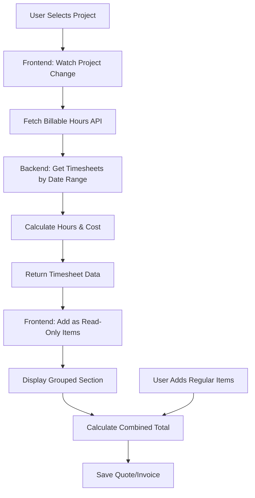

# Connect Timesheet Hours to Quotes and Invoices

## Overview

When a project is selected in a quote or invoice, automatically fetch and display billable timesheet hours within the date range (from issue date to current date). Timesheet hours will appear as a grouped, read-only section in the items table, and the total will combine both item costs and timesheet hours costs.

## Architecture



## Implementation Plan

### 1. Database Schema Updates

**File**: `backend/prisma/schema.prisma`

- Add `TIMESHEET` to `InvoiceItemType` enum:
  ```prisma
  enum InvoiceItemType {
    ITEM
    HEADER
    TIMESHEET
  }
  ```

- Add `type` field to `QuoteItem` model and create `QuoteItemType` enum:
  ```prisma
  enum QuoteItemType {
    ITEM
    HEADER
    TIMESHEET
  }
  
  model QuoteItem {
    // ... existing fields
    type        QuoteItemType @default(ITEM)
  }
  ```


### 2. Backend: Timesheet Service Updates

**File**: `backend/src/services/timesheetService.ts`

- Create new function `getBillableHoursByProjectAndDateRange`:
  - Accept `projectId`, `startDate`, `endDate`
  - Filter timesheets by `projectId`, `billable: true`, and date range
  - Return timesheets array and total hours
  - Calculate total cost (hours × hourlyRate)

- Update `getBillableHoursByProject` to optionally accept date range parameters

### 3. Backend: API Endpoints

**File**: `backend/src/controllers/timesheetController.ts` (or create new controller)

- Create `getBillableHoursForProject` endpoint:
  - Route: `GET /timesheets/project/:projectId/billable`
  - Query params: `startDate`, `endDate` (optional)
  - Returns: timesheets array, totalHours, totalCost, project hourlyRate

**File**: `backend/src/routes/timesheets.ts`

- Add new route for billable hours endpoint

### 4. Backend: Quote/Invoice Service Updates

**File**: `backend/src/services/quoteService.ts`

- Modify `createQuote` to automatically add timesheet hours when `projectId` is provided:
  - Fetch billable hours for project within date range (issueDate to current date)
  - Create `QuoteItem` entries with `type: TIMESHEET` for each timesheet entry
  - Mark as read-only (store in metadata or use special naming)

**File**: `backend/src/services/invoiceService.ts`

- Modify `createInvoice` to automatically add timesheet hours when `projectId` is provided:
  - Fetch billable hours for project within date range (issueDate to current date)
  - Create `InvoiceItem` entries with `type: TIMESHEET` for each timesheet entry
  - Mark as read-only

### 5. Frontend: Quote Form Updates

**File**: `frontend/src/pages/Quotes/QuoteForm.tsx`

- Add `useEffect` to watch `projectId` changes:
  - When project is selected and `issueDate` exists, fetch billable hours
  - Automatically add timesheet hours as read-only items to the form
  - Group timesheet items with a header row (`type: HEADER` with name "Timesheet Hours")
  - Individual timesheet entries below the header

- Update items table to handle read-only timesheet items:
  - Disable editing for items with `type: TIMESHEET`
  - Show visual indicator (different styling or icon)

### 6. Frontend: Invoice Form Updates

**File**: `frontend/src/pages/Invoices/InvoiceForm.tsx`

- Add `useEffect` to watch `projectId` changes:
  - When project is selected and `issueDate` exists, fetch billable hours
  - Automatically add timesheet hours as read-only items to the form
  - Group timesheet items with a header row
  - Individual timesheet entries below the header

- Update items table to handle read-only timesheet items

### 7. Frontend: Items Table Components

**File**: `frontend/src/components/Quotes/QuoteItemsTable.tsx`

- Add logic to render timesheet items as read-only:
  - Disable input fields for `type: TIMESHEET`
  - Show different styling (grayed out or with lock icon)
  - Prevent deletion of timesheet items

**File**: `frontend/src/components/Invoices/InvoiceItemsTable.tsx`

- Same updates as QuoteItemsTable for timesheet items

### 8. Frontend: API Service

**File**: `frontend/src/services/api.ts` (or create timesheet service)

- Add function to fetch billable hours:
  ```typescript
  getBillableHoursForProject(projectId: string, startDate?: string, endDate?: string)
  ```


### 9. Total Calculation

**Files**: `frontend/src/pages/Quotes/QuoteForm.tsx`, `frontend/src/pages/Invoices/InvoiceForm.tsx`

- Ensure total calculation includes both:
  - Regular items (ITEM type)
  - Timesheet hours (TIMESHEET type)
  - Headers are excluded from calculations

## Data Flow

1. User selects project in quote/invoice form
2. Frontend watches `projectId` change
3. If `issueDate` exists, fetch billable hours API with date range
4. Backend returns timesheet entries with hours and costs
5. Frontend adds timesheet items to form:

   - Header row: "Timesheet Hours" (type: HEADER)
   - Individual entries: Each timesheet as read-only item (type: TIMESHEET)

6. Items table displays grouped section with read-only styling
7. Total calculation includes items + timesheet hours
8. On save, all items (including timesheet) are saved to database

## Edge Cases

- If project is changed, remove old timesheet items and add new ones
- If project is deselected, remove timesheet items
- If issueDate changes after project is selected, refetch timesheet hours with new date range
- Handle case where no billable hours exist (show message or nothing)
- Prevent duplicate timesheet items if project is re-selected

## Testing Considerations

- Test with project that has no timesheets
- Test with project that has timesheets outside date range
- Test with project that has both billable and non-billable hours
- Test changing project selection
- Test removing project selection
- Verify totals calculate correctly with